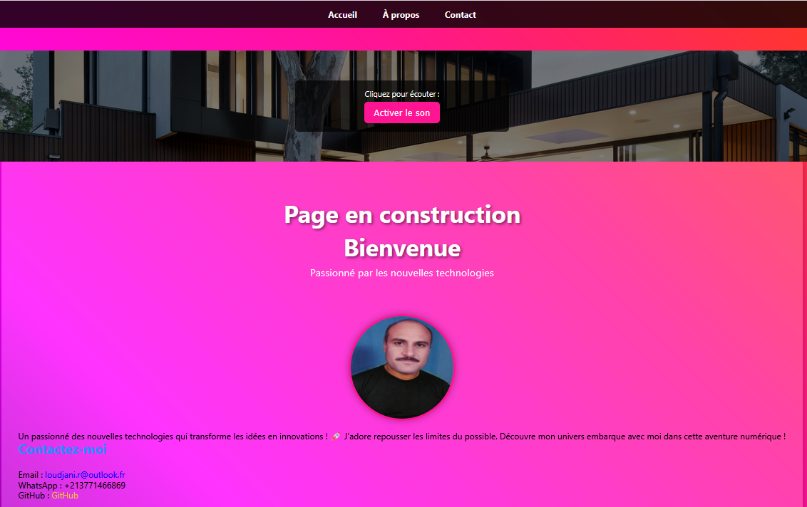

# Portfolio Rabah Loudjani

Ce projet est une page web personnelle conçue comme un portfolio pour présenter mon parcours, ma passion pour les nouvelles technologies et mes coordonnées. Avec un design moderne, coloré et réactif, il offre une expérience utilisateur fluide et visuellement attrayante et en bonus vous avez droit à la musique &#127925; | https://universal-soundbank.com/sounds/13570.mp3



## Aperçu

La page est structurée en trois sections principales :
- **Accueil** : Une introduction accueillante avec un appel à l'action pour en savoir plus.
- **À propos** : Une présentation personnelle avec une photo de profil et une description de mes intérêts.
- **Contact** : Un formulaire interactif et des liens vers mes coordonnées (Email, WhatsApp, GitHub).

Le design repose sur un dégradé vibrant, une navigation fixe, des effets visuels (ombres, transitions, flou) et une mise en page optimisée pour tous les écrans.

## Fonctionnalités

- **Navigation intuitive** : Menu sticky pour un accès rapide aux sections.
- **Formulaire de contact** : Champs pour nom, email et message, avec un bouton stylisé.
- **Liens sociaux** : Liens directs vers Email, WhatsApp et GitHub.
- **Design réactif** : Adapté aux mobiles, tablettes et ordinateurs grâce à Flexbox.
- **Effets visuels** : Dégradé de fond, ombres, transitions au survol et effet de flou (backdrop-filter).

## Technologies utilisées

- **HTML5** : Structure sémantique avec des sections bien définies.
- **CSS3** : Styles avancés avec dégradés, Flexbox, animations et filtres.
- **Images externes** : Logo et photo de profil hébergés sur Imgur.

## Prérequis

Aucun logiciel ou dépendance spécifique n'est requis. Un navigateur web moderne (Chrome, Firefox, Safari, etc.) suffit pour visualiser la page.

## Installation et exécution

1. Clonez ce dépôt :
   ```bash
   git clone https://github.com/jawed56.git

Ouvrez le fichier index.html dans un navigateur : 
Double-cliquez sur index.html, https://jawed56.github.io/portfolio/index.html
Consultez le code source sur GitHub : https://github.com/jawed56/portfolio


Lancez un serveur local (par exemple, avec l'extension Live Server de VS Code).

Structure du projet

├── index.html       # Fichier principal contenant le HTML et CSS
├── README.md        # Documentation du projet

Personnalisation
Pour adapter ce projet :
Images : Remplacez les URLs du logo (https://i.imgur.com/5v4Hsed.jpeg) et de la photo de profil (https://i.imgur.com/PfQVRUW.jpeg) dans index.html.

Styles : Modifiez les couleurs, polices ou animations dans la section <style> de index.html.

Contenu : Mettez à jour le texte des sections #home, #about et #contact.

Formulaire : Connectez le formulaire à un backend (par exemple, JavaScript ou Formspree) pour gérer les soumissions.

Démo
Consultez le site live ici : https://jawed56.github.io/
Consultez le code source sur GitHub : https://github.com/jawed56/
Captures d'écran
Auteur
Rabah Loudjani
Email : loudjani.r@gmail.com (mailto:loudjani.r@gmail.com)
WhatsApp : +213771466869
GitHub : jawed56

De la Musique pour votre confort : http://radios.rtbf.be/laprem1ere-128.mp3

Contribution
Ce projet est personnel, mais les suggestions sont les bienvenues ! Pour contribuer, ouvrez une issue ou une pull request sur le dépôt GitHub.
Licence
© 2025 Rabah Loudjani. Ce projet est destiné à un usage personnel. Vous pouvez le modifier pour vos propres besoins, mais veuillez respecter les droits d'auteur pour toute utilisation commerciale.
